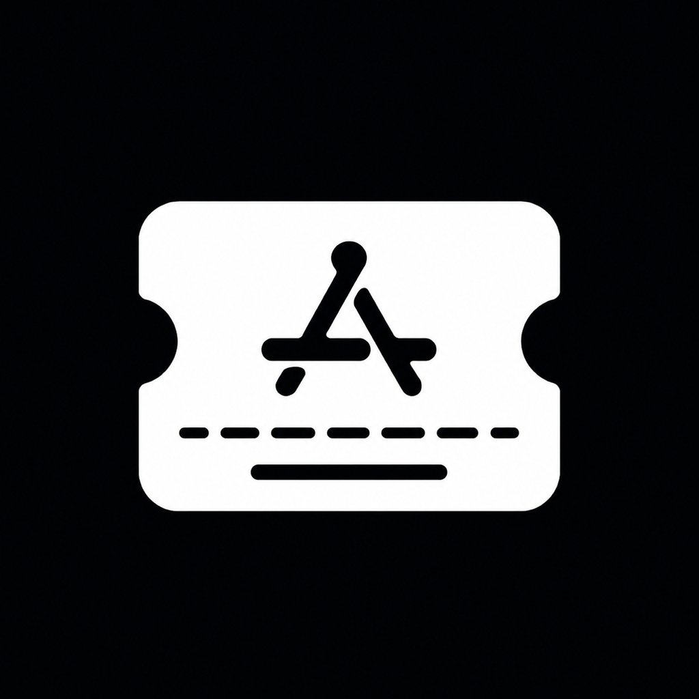
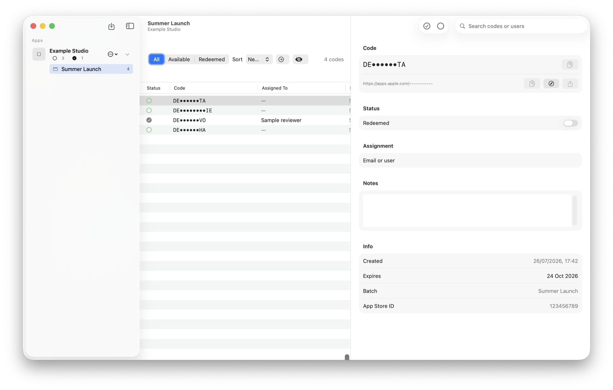

<p align="center">
  
</p>

<h1 align="center">CodeVault</h1>

<p align="center">
  A private, native manager for App Store offer and promo codes.
</p>

<p align="center">
  
  
  <a href="LICENSE"></a>
</p>



CodeVault keeps offer codes organised by app and import batch, helps you find the next available code, and records which codes have already been redeemed. It is built entirely with SwiftUI and SwiftData, with private CloudKit sync for the author's production configuration.

## Features

- Import App Store Connect CSV files with drag and drop or the file picker.
- Group codes by app and import batch.
- Search, filter, sort, rename, and export code batches.
- Get the next available, unexpired code in one action.
- Mark codes as available or redeemed and copy a code or redemption URL.
- Display redemption QR codes and share codes from iPhone or iPad.
- Mask sensitive codes with privacy mode.
- Receive optional notifications when codes are close to expiring.
- Sync data privately between devices with CloudKit when configured.

## Requirements

- Xcode 26.1 or later
- iOS or iPadOS 17.0 or later, or macOS 26.1 or later
- An Apple Developer account and your own iCloud container if you want CloudKit sync

CodeVault has no third-party package dependencies.

## Getting started

1. Clone the repository:

   ```sh
   git clone https://github.com/mcomisso/AppStoreCodes.git
   cd AppStoreCodes
   ```

2. Open `CodeVault.xcodeproj` in Xcode.
3. Select the `CodeVault` scheme and an iOS simulator or **My Mac**.
4. Configure signing as described below, then run the app.

You can also build the macOS app from the command line:

```sh
xcodebuild \
  -project CodeVault.xcodeproj \
  -scheme CodeVault \
  -destination 'platform=macOS' \
  build
```

### Signing and CloudKit in a fork

The checked-in production configuration refers to the original app's bundle identifier, development team, and private CloudKit container. Those identifiers cannot be shared with another Apple Developer team.

For your fork, select the `CodeVault` target in Xcode and:

1. Choose your own team under **Signing & Capabilities**.
2. Change the bundle identifier to one registered to your team.
3. Replace `iCloud.com.mcsoftware.AppStoreCodes` with an iCloud container owned by your team.
4. Update the container name in both `AppStoreCodes.entitlements` and the `ModelConfiguration` in `AppStoreCodesApp.swift`.

If you only want a local development build, remove the iCloud capability and use a local SwiftData `ModelConfiguration` instead.

## Import format

CodeVault accepts the CSV exported by App Store Connect. A minimal file contains a code and its redemption URL:

```csv
Code,Redemption URL
EXAMPLE-CODE,https://apps.apple.com/redeem?id=123456789&code=EXAMPLE-CODE
```

Do not commit real offer codes, App Store Connect private keys, or screenshots containing unmasked codes.

## Testing

Run the unit and UI test targets from Xcode, or run the macOS test suite from the command line:

```sh
xcodebuild \
  -project CodeVault.xcodeproj \
  -scheme CodeVault \
  -destination 'platform=macOS' \
  test
```

## Contributing

Contributions are welcome. Read [CONTRIBUTING.md](CONTRIBUTING.md) before opening an issue or pull request. Please report sensitive security issues using the process in [SECURITY.md](SECURITY.md).

## License

CodeVault is available under the [MIT License](LICENSE).
